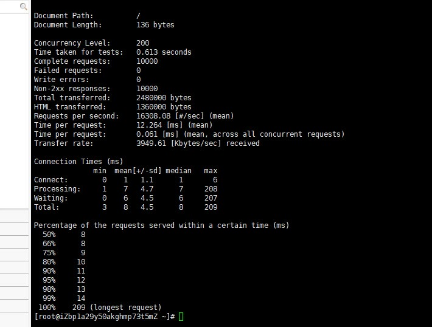
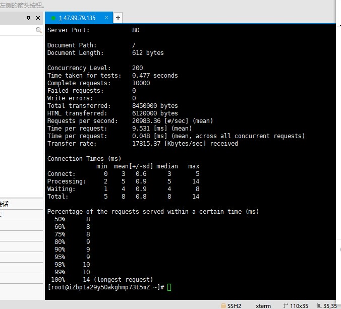

# Webbench

## 安装
```bash
yum install -y ctags
wget http://home.tiscali.cz/~cz210552/distfiles/webbench-1.5.tar.gz
tar -zxvf webbench-1.5.tar.gz
cd webbench-1.5/
make
make install
```

## 使用

```bash
webbench -c 10000 -t 5 http://localhost:8080/index.html
webbench -c 10000 -t 5 http://localhost:8080/index/index.html
```

## 对比

### juhps-server



### nginx

