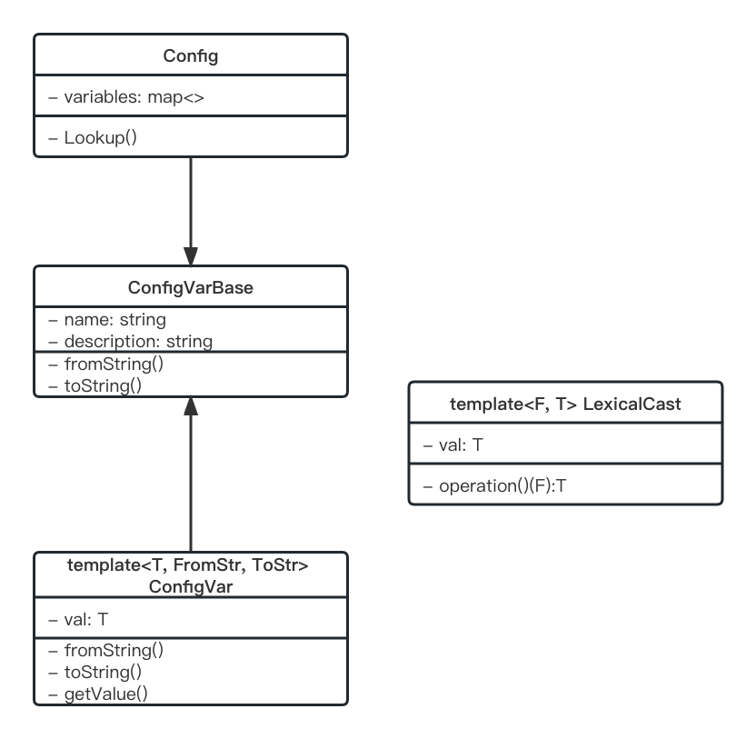

# 配置模块

> 用于定义/声明配置项，并且从配置文件中加载用户配置，体现约定大于配置的思想，配置文件采用yml，并用yaml-cpp进行解析，用片特化的方式实现数据类型的序列化和反序列，并用回调函数的机制使其生效。

参考谷歌开源的基于命令行的C++配置库：gflags



## 1. 模块设计

> 采用约定优于配置的思想

简单来说，约定优于配置的背景条件是，一般来说，程序所依赖的配置项都有一个公认的默认值，也就是所谓的约定。这点有可许多可以参考的例子，比如对于一个http网络服务器，服务端口通常都是80端口，对于配置文件夹路径，一般都是conf文件夹，对于数据库目录，一般都是db或data文件夹。对于这些具有公认约定的配置，就不需要麻烦程序员在程序跑起来后再一项一项地指定了，而是可以初始时就将配置项设置成对应的值。这样，程序员就可以只修改那些约定之外的配置项，然后以最小的代价让程序跑起来。

约定优于配置的方式可以减少程序员做决定的数量，获得简单的好处，同时兼顾灵活性。

一般而言，一项配置应该包括以下要素：

1. 名称，对应一个字符串，必须唯一，不能与其他配置项产生冲突。

2. 类型，可以是基本类型，但也应该支持复杂类型和自定义类型。

3. 值。

3. 默认值，考虑到用户不一定总是会显式地给配置项赋值，所以配置项最好有一个默认值。

4. 配置变更通知，一旦用户更新了配置值，那么应该通知所有使用了这项配置的代码，以便于进行一些具体的操作，比如重新打开文件，重新起监听端口等。

5. 校验方法，更新配置时会调用校验方法进行校验，以保证用户不会给配置项设置一个非法的值。

一个配置模块应具备的基本功能：

1. 支持定义/声明配置项，也就是在提供配置名称、类型以及可选的默认值的情况下生成一个可用的配置项。由于一项配置可能在多个源文件中使用，所以配置模块还应该支持跨文件声明配置项的方法。

2. 支持更新配置项的值。这点很好理解，配置项刚被定义时可能有一个初始默认值，但用户可能会有新的值来覆盖掉原来的值。

2. 支持从预置的途径中加载配置项，一般是配置文件，也可以是命令行参数，或是网络服务器。这里不仅应该支持基本数据类型的加载，也应该支持复杂数据类型的加载，比如直接从配置文件中加载一个map类型的配置项，或是直接从一个预定格式的配置文件中加载一个自定义结构体。

3. 支持给配置项注册配置变更通知。配置模块应该提供方法让程序知道某项配置被修改了，以便于进行一些操作。比如对于网络服务器而言，如果服务器端口配置变化了，那程序应该重新起监听端口。这个功能一般是通过注册回调函数来实现的，配置使用方预先给配置项注册一个配置变更回调函数，配置项发生变化时，触发对应的回调函数以通知调用方。由于一项配置可能在多个地方引用，所以配置变更回调函数应该是一个数组的形式。

4. 支持给配置项设置校验方法。配置项在定义时也可以指定一个校验方法，以保证该项配置不会被设置成一个非法的值，比如对于文件路径类的配置，可以通过校验方法来确保该路径一定存在。

5. 支持导出当前配置。

## 2. 模块实现

### 2.1 ConfigVarBase

> 配置项基类

每个配置项都包括`name`和`description`，以及`toString()`和`fromString()`两个纯虚函数，用于和YAML字符串进行相互转换。但并不包括配置项类型和值，由继承类实现。

不区分大小写，全部用`transform()`转成小写进行配置。

### 2.2 ConfigVar

> 配置参数类（继承ConfigVarBase）

#### 2.2.1 定义成模版类

`template <class T, class FromStr = LexicalCast<std::string, T> , class ToStr = LexicalCast<T, std::string> >`

`T`为配置项的类型，`FromStr()`和`ToStr()`用于YAML字符串的转换，并根据不同的`T`实现不同的片特化。

#### 2.2.2 支持变更配置

`setValue/getValue`方法用于获取/更新配置值（更新配置时会一并触发全部的配置变更回调函数）\
`addListener/delListener`方法用于添加或删除配置变更回调函数。

### 2.3 Config

> 配置管理类

负责托管ConfigVar对象。

所有成员都为`static`，保证全局只有一个实例。

#### 2.3.1 Lookup

> 用于根据配置名称查询配置项。

如果调用Lookup查询时同时提供了默认值和配置项的描述信息，那么在未找到对应的配置时，会自动创建一个对应的配置项，这样就保证了配置模块定义即可用的特性。

#### 2.3.2 LoadFromYaml

> 从YAML对象加载配置。

### 2.4 yaml-cpp

项目的配置文件采用yml，并用yaml-cpp库进行解析。

对于每种类型的配置，在对应的`ConfigVar`模版类实例化时都要提供`FromStr`和`ToStr`两个仿函数，用于实现该类型和YAML字符串的相互转换。

对于每种数据类型，包括自定义数据类型，都需要片特化。从一个基本类型的转换类开始，特化出其他类型的转换类。

```C++
template<class F, class T>
class LexicalCast {
public:
    /**
     * @brief 类型转换
     * @param[in] v 源类型值
     * @return 返回v转换后的目标类型
     * @exception 当类型不可转换时抛出异常
     */
    T operator()(const F& v) {
        return boost::lexical_cast<T>(v);
    }
};
```

实现了`int`、`vector`、`set`、`map`等类型，根据这些类型的搭配，还实现其他复杂类型，例如`vector<set>`、`set<vector>`等等。

### 2.5 Usage

```bash
YAML::Node root = YAML::LoadFile("url/*.yml");
jujimeizuo::Config::LoadFromYaml(root);
```
#### 2.5.1 unordered_map做配置

```C++
jujimeizuo::ConfigVar<std::unordered_map<std::string, int> >::ptr g_str_int_unordered_map_value_config =
	jujimeizuo::Config::Lookup("system.str_int_unordered_map", std::unordered_map<std::string, int>{{"k", 2}}, "system str int unordered_map");
```

```bash
2022-09-01 00:03:24     4294967295      0       [INFO]  [root]  /Users/fengzetao/Desktop/WebServer/tests/test_config.cc:142     after str_int_unordered_map: {k2 - 20}
```

## 3. 总结

采用约定由于配置的思想。定义即可使用。不需要单独去解析。支持变更通知功能。使用YAML文件做为配置内容。支持级别格式的数据类型，支持STL容器(vector,list,set,map等等),支持自定义类型的支持（需要实现序列化和反序列化方法)。

通过配置系统对日志进行配置需要对日志里的类型进行片特化处理，这样在处理序列化与反序列化的时候才能识别yml文件中的log配置。具体在`LogDefine`和`LogAppenderDefine`。