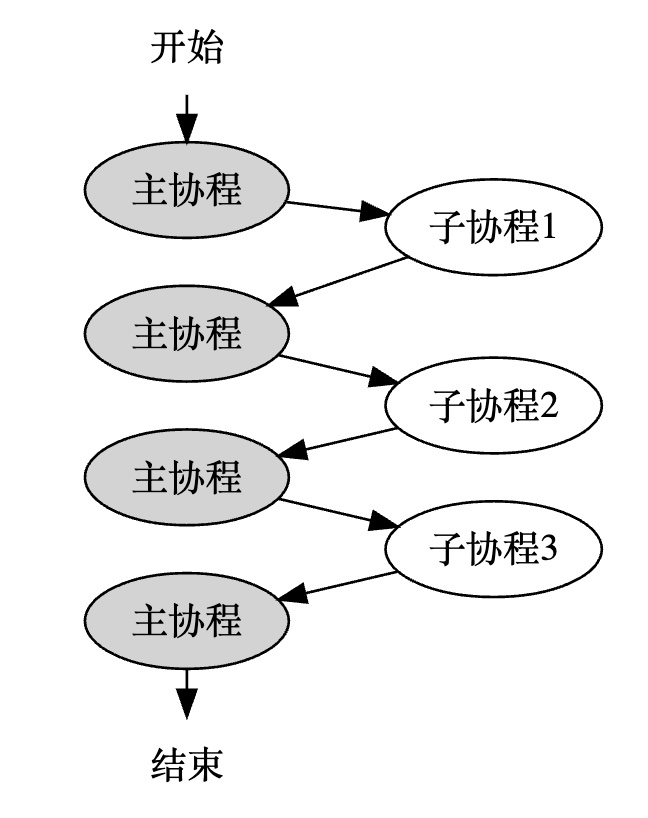

# 协程模块

> 基于ucontext_t实现非对称协程。也就是子协程只能和线程主协程切换，而不能和另一个子协程切换，并且在程序结束时，一定要再切回主协程，以保证程序能正常结束。


## 1. ucontext_t

> 实现一个进程中的用户级线程（协程）切换。

```C++
// 上下文结构体定义
// 这个结构体是平台相关的，因为不同平台的寄存器不一样
// 下面列出的是所有平台都至少会包含的4个成员
typedef struct ucontext_t {
    // 当前上下文结束后，下一个激活的上下文对象的指针，只在当前上下文是由makecontext创建时有效
    struct ucontext_t *uc_link;
    // 当前上下文的信号屏蔽掩码
    sigset_t          uc_sigmask;
    // 当前上下文使用的栈内存空间，只在当前上下文是由makecontext创建时有效
    stack_t           uc_stack;
    // 平台相关的上下文具体内容，包含寄存器的值
    mcontext_t        uc_mcontext;
    ...
} ucontext_t;
 
// 获取当前的上下文
int getcontext(ucontext_t *ucp);
 
// 恢复ucp指向的上下文，这个函数不会返回，而是会跳转到ucp上下文对应的函数中执行，相当于变相调用了函数
int setcontext(const ucontext_t *ucp);
 
// 修改由getcontext获取到的上下文指针ucp，将其与一个函数func进行绑定，支持指定func运行时的参数，
// 在调用makecontext之前，必须手动给ucp分配一段内存空间，存储在ucp->uc_stack中，这段内存空间将作为func函数运行时的栈空间，
// 同时也可以指定ucp->uc_link，表示函数运行结束后恢复uc_link指向的上下文，
// 如果不赋值uc_link，那func函数结束时必须调用setcontext或swapcontext以重新指定一个有效的上下文，否则程序就跑飞了
// makecontext执行完后，ucp就与函数func绑定了，调用setcontext或swapcontext激活ucp时，func就会被运行
void makecontext(ucontext_t *ucp, void (*func)(), int argc, ...);
 
// 恢复ucp指向的上下文，同时将当前的上下文存储到oucp中，
// 和setcontext一样，swapcontext也不会返回，而是会跳转到ucp上下文对应的函数中执行，相当于调用了函数
// swapcontext是sylar非对称协程实现的关键，线程主协程和子协程用这个接口进行上下文切换
int swapcontext(ucontext_t *oucp, const ucontext_t *ucp);
```

## 2. 模块设计

使用非对称协程模型，也就是子协程只能和线程主协程切换，而不能和另一个子协程切换，并且在程序结束时，一定要再切回主协程，以保证程序能正常结束。

<div align="center">
    
</div>

在对称协程中，子协程可以直接和子协程切换，也就是说每个协程不仅要运行自己的入口函数代码，还要负责选出下一个合适的协程进行切换，相当于每个协程都要充当调度器的角色，这样程序设计起来会比较麻烦，并且程序的控制流也会变得复杂和难以管理。而在非对称协程中，可以借助专门的调度器来负责调度协程，每个协程只需要运行自己的入口函数，然后结束时将运行权交回给调度器，由调度器来选出下一个要执行的协程即可。

非对称协程的行为与函数类似，因为函数在运行结束后也总是会返回调用者。

虽然目前还没有涉及到协程调度，但这里其实可以将线程的主协程想像成线程的调度协程，每个子协程执行完了，都必须切回线程主协程，由主协程负责选出下一个要执行的子协程。如果子协程可以和子协程切换，那就相当于变相赋予了子协程调度的权利，这在非对称协程里是不允许的。

借助了线程局部变量的功能来实现协程模块。线程局部变量与全局变量类似，不同之处在于声明的线程局部变量在每个线程都独有一份，而全局变量是全部线程共享一份。

使用线程局部变量（C++11 thread_local变量）来保存协程上下文对象，这点很好理解，因为协程是在线程里运行的，不同线程的协程相互不影响，每个线程都要独自处理当前线程的协程切换问题。

对于每个线程的协程上下文，设计了两个线程局部变量来存储上下文信息（对应源码的t_fiber和t_thread_fiber），也就是说，一个线程在任何时候最多只能知道两个协程的上下文。又由于只使用swapcontext来做协程切换，那就意味着，这两个线程局部变量必须至少有一个是用来保存线程主协程的上下文的，如果这两个线程局部变量存储的都是子协程的上下文，那么不管怎么调用swapcontext，都没法恢复主协程的上下文，也就意味着程序最终无法回到主协程去执行，程序也就跑飞了。

<div align="center">
    
</div>

如果将线程的局部变量设置成一个类似链表的数据结构，那理论上应该也可以实现对称协程，也就是子协程可以直接和子协程切换，但代码复杂度上肯定会增加不少，因为要考虑多线程和公平调度的问题。

非对称协程代码实现简单，并且在后面实现协程调度时可以做到公平调度，缺点是子协程只能和线程主协程切换，意味着子协程无法创建并运行新的子协程，并且在后面实现协程调度时，完成一次子协程调度需要额外多切换一次上下文。

## 3. 模块实现

## 3.1 协程状态

```C++
enum State {
    INIT,       // 初始化状态
    HOLD,       // 暂停状态
    EXEC,       // 执行中状态
    TERM,       // 结束状态
    READY,      // 可执行状态
    EXCEPT      // 异常状态
};
```

### 3.2 协程原语

对于非对称协程来说，协程除了创建语句外，只有两种操作，一种是resume，表示恢复协程运行，一种是yield，表示让出执行。协程的结束没有专门的操作，协程函数运行结束时协程即结束，协程结束时会自动调用一次yield以返回主协程。


### 3.3 协程类

#### 3.3.1 Fiber

主要成员变量:
```C++
uint64_t m_id = 0;              // 协程id
uint32_t m_stacksize = 0;       // 协程运行栈大小
State m_state = INIT;           // 协程状态
ucontext_t m_ctx;               // 协程上下文
void* m_stack = nullptr;        // 协程运行栈指针
std::function<void()> m_cb;     // 协程运行函数
```

#### 3.3.2 全局与线程局部变量

```C++
// 全局静态变量，用于生成协程id
static std::atomic<uint64_t> s_fiber_id{0};
// 全局静态变量，用于统计当前的协程数
static std::atomic<uint64_t> s_fiber_count{0};
// 线程局部变量，当前线程正在运行的协程
static thread_local Fiber *t_fiber = nullptr;
// 线程局部变量，当前线程的主协程，切换到这个协程，就相当于切换到了主线程中运行，智能指针形式
static thread_local Fiber::ptr t_thread_fiber = nullptr;
```

`t_fiber`：保存当前正在运行的协程指针，必须时刻指向当前正在运行的协程对象。协程模块初始化时，`t_fiber`指向线程主协程对象。

`t_thread_fiber`：保存线程主协程指针，智能指针形式。协程模块初始化时，`t_thread_fiber`指向线程主协程对象。当子协程`resume`时，通过`swapcontext`将主协程的上下文保存到`t_thread_fiber`的`ucontext_t`成员中，同时激活子协程的`ucontext_t`上下文。当子协程`yield`时，从`t_thread_fiber`中取得主协程的上下文并恢复运行。

#### 3.3.3 GetThis()

> 如果存在协程，则返回对象，否则先创建主协程，让t_fiber指向主协程并返回。

缺点：在使用协程之前必须显式调用一次GetThis()。

```C++
Fiber::ptr Fiber::GetThis() {
    if (t_fiber) {
        return t_fiber -> shared_from_this();
    }
    Fiber::ptr main_fiber(new Fiber);
    JUJIMEIZUO_ASSERT(t_fiber == main_fiber.get());
    t_threadFiber = main_fiber;
    return t_fiber -> shared_from_this();
}
```

#### 3.3.4 MainFunc()

> 协程入口函数

封装用户的协程入口函数，在函数结束时自动执行yield操作。

```C++
void Fiber::MainFunc() {
    Fiber::ptr cur = GetThis(); // GetThis()的shared_from_this()方法让引用计数加1
    JUJIMEIZUO_ASSERT(cur);
 
    cur->m_cb(); // 这里真正执行协程的入口函数
    cur->m_cb    = nullptr;
    cur->m_state = TERM;
 
    auto raw_ptr = cur.get(); // 手动让t_fiber的引用计数减1
    cur.reset(); // 重复利用已结束的协程，复用其栈空间，创建新协程
    raw_ptr->swapOut(); // 协程结束时自动yield，以回到主协程
}
```

## 总结

1. 协程id：通过全局静态变量s_fiber_id的自增来生成协程id，每创建一个新协程，s_fiber_id自增1，并作为新协程的id（实际是先取值，再自增1）。
2. 主协程创建：线程主协程代表线程入口函数或是main函数所在的协程，这两种函数都不是以协程的手段创建的，所以它们只有ucontext_t上下文，但没有入口函数，也没有分配栈空间。
3. 协程切换：子协程的resume操作一定是在主协程里执行的，主协程的resume操作一定是在子协程里执行的。