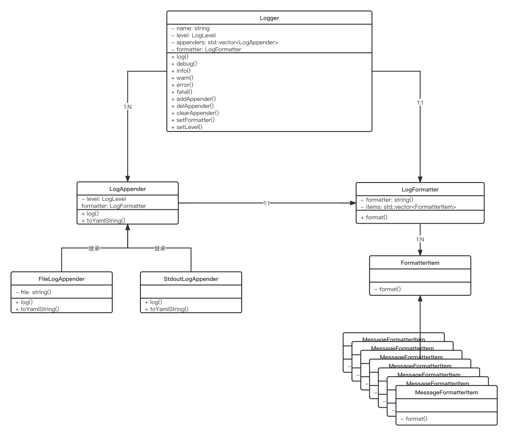

# 日志模块

> 用于格式化输出程序日志，方便从日志中定位程序运行过程中出现的问题。这里的日志除了日志内容本身之外，还应该包括文件名/行号，时间戳，线程/协程号，模块名称，日志级别等额外信息，甚至在打印致命的日志时，还应该附加程序的栈回溯信息，以便于分析和排查问题。



## 1. LogLevel

> 日志级别

参考log4cpp的设计：

```C++
enum Level {
    UNKNOW = 0,
    DEBUG = 1,
    INFO = 2,
    WARN = 3,
    ERROR = 4,
    FATAL = 5
};
```

## 2. LogEvent

> 日志事件

用于记录日志现场，比如该日志的级别，文件名/行号，日志消息，线程/协程号，所属日志器名称等。


## 3. LogEventWrap

> 日志事件包装类

将日志事件和日志器包装到一起。因为一条日志只会在一个日志器上进行输出。将日志事件和日志器包装到一起后，方便通过宏定义来简化日志模块的使用。另外，LogEventWrap还负责在构建时指定日志事件和日志器，在析构时调用日志器的log方法将日志事件进行输出。

## 4. Logger

> 日志器

一个Logger包含多个LogAppender和一个日志级别，提供log方法，传入日志事件，判断该日志事件的级别高于日志器本身的级别之后调用LogAppender将日志进行输出，否则该日志被抛弃。

## 5. LogAppender

> 日志输出目标

用于将一个日志事件输出到对应的输出地。该类内部包含一个LogFormatter成员和一个log方法，日志事件先经过LogFormatter格式化后再输出到对应的输出地。从这个类可以派生出不同的Appender类型，比如StdoutLogAppender和FileLogAppender，分别表示输出到终端和文件。

## 6. LogFormatter

> 日志格式器

与log4cpp的PatternLayout对应，用于格式化一个日志事件。该类构建时可以指定pattern，表示如何进行格式化。提供format方法，用于将日志事件格式化成字符串。

## 7. LogManager

> 日志器管理类

单例模式的设计，用于统一管理所有的日志器，提供日志器的创建与获取方法。LogManager自带一个root Logger，用于为日志模块提供一个初始可用的日志器。


## 8. Usage

> 采用宏定义方式

```C++
#define JUJIMEIZUO_LOG_DEBUG(logger) JUJIMEIZUO_LOG_LEVEL(logger, jujimeizuo::LogLevel::DEBUG)

#define JUJIMEIZUO_LOG_FMT_DEBUG(logger, fmt, ...) JUJIMEIZUO_LOG_FMT_LEVEL(logger, jujimeizuo::LogLevel::DEBUG, fmt, __VA_ARGS__)
```

eg:

```C++
jujimeizuo::Logger::ptr g_logger = JUJIMEIZUO_LOG_ROOT();
JUJIMEIZUO_LOG_INFO(g_logger) << "info msg";
```

这里要实现通过g_logger打印一条INFO级别的消息。那么，首先判断INFO级别是否高于g_logger本身的日志级别（这里的设计与原版sylar相反，数字越小，优先级越高），如果不高于，那if语句执行不到，这条日志也不会打印，否则，临时构造一个LogEventWrap对象，传入日志器g_logger，以及现场构造的日志事件。通过LogEventWrap的getLogEvent()方法拿到日志事件，再用日志事件的流式日志消息成员输出日志消息。由于LogEventWrap是在if语句内部构建的，一旦if语句执行结束，LogEventWrap对象就会析构，日志事件也就会被g_logger进行输出。

## 9. 总结

日志模块的工作流程：

1. 初始化LogFormatter，LogAppender, Logger。
2. 通过宏定义提供流式风格和格式化风格的日志接口。每次写日志时，通过宏自动生成对应的日志事件LogEvent，并且将日志事件和日志器Logger包装到一起，生成一个LogEventWrap对象。
3. 日志接口执行结束后，LogEventWrap对象析构，在析构函数里调用Logger的log方法将日志事件进行输出。