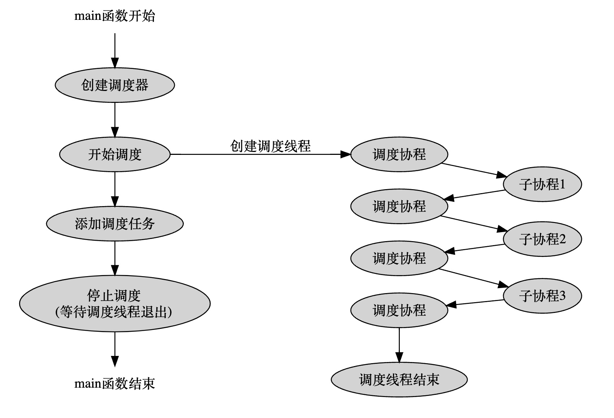

# 线程调度模块

> 实现了一个N-M的协程调度器，N个线程运行M个协程，协程可以在线程之间进行切换，也可以绑定到指定线程运行。

实现协程调度之后，可以解决协程模块中子协程不能运行另一个子协程的缺陷，子协程可以通过向调度器添加调度任务的方式来运行另一个子协程。

## 1. 模块设计

调度器内部维护一个任务队列和一个调度线程池。开始调度后，线程池从任务队列里按顺序取任务执行。调度线程可以包含caller线程。当全部任务都执行完了，线程池停止调度，等新的任务进来。添加新任务后，通知线程池有新的任务进来了，线程池重新开始运行调度。停止调度时，各调度线程退出，调度器停止工作。

协程调度模块支持多线程，支持使用caller线程进行调度，支持添加函数或协程作为调度对象，并且支持将函数或协程绑定到一个具体的线程上执行。

首先是协程调度器的初始化。协程调度器在初始化时支持传入线程数和一个布尔型的use_caller参数，表示是否使用caller线程。在使用caller线程的情况下，线程数自动减一，并且调度器内部会初始化一个属于caller线程的调度协程并保存起来（比如，在main函数中创建的调度器，如果use_caller为true，那调度器会初始化一个属于main函数线程的调度协程）。

调度器创建好后，即可调用调度器的schedule方法向调度器添加调度任务，但此时调度器并不会立刻执行这些任务，而是将它们保存到内部的一个任务队列中。

接下来是调用start方法启动调度。start方法调用后会创建调度线程池，线程数量由初始化时的线程数和use_caller确定。调度线程一旦创建，就会立刻从任务队列里取任务执行。比较特殊的一点是，如果初始化时指定线程数为1且use_caller为true，那么start方法什么也不做，因为不需要创建新线程用于调度。并且，由于没有创建新的调度线程，那只能由caller线程的调度协程来负责调度协程，而caller线程的调度协程的执行时机与start方法并不在同一个地方。

接下来是调度协程，对应run方法。调度协程负责从调度器的任务队列中取任务执行。取出的任务即子协程，这里调度协程和子协程的切换模型即为前一章介绍的非对称模型，每个子协程执行完后都必须返回调度协程，由调度协程重新从任务队列中取新的协程并执行。如果任务队列空了，那么调度协程会切换到一个idle协程，这个idle协程什么也不做，等有新任务进来时，idle协程才会退出并回到调度协程，重新开始下一轮调度。

在非caller线程里，调度协程就是调度线程的主线程，但在caller线程里，调度协程并不是caller线程的主协程，而是相当于caller线程的子协程，这在协程切换时会有大麻烦（这点是协程调度模块最难理解的地方），如何处理这个问题将在下面的章节专门进行讨论。

接下来是添加调度任务，对应schedule方法，这个方法支持传入协程或函数，并且支持一个线程号参数，表示是否将这个协程或函数绑定到一个具体的线程上执行。如果任务队列为空，那么在添加任务之后，要调用一次tickle方法以通知各调度线程的调度协程有新任务来了。

在执行调度任务时，还可以通过调度器的GetThis()方法获取到当前调度器，再通过schedule方法继续添加新的任务，这就变相实现了在子协程中创建并运行新的子协程的功能。

接下来是调度器的停止。调度器的停止行为要分两种情况讨论，首先是use_caller为false的情况，这种情况下，由于没有使用caller线程进行调度，那么只需要简单地等各个调度线程的调度协程退出就行了。如果use_caller为true，表示caller线程也要参于调度，这时，调度器初始化时记录的属于caller线程的调度协程就要起作用了，在调度器停止前，应该让这个caller线程的调度协程也运行一次，让caller线程完成调度工作后再退出。如果调度器只使用了caller线程进行调度，那么所有的调度任务要在调度器停止时才会被调度。

## 2. 调度器切换

这里分两种典型情况来讨论一下调度协程的切换情况，其他情况可以看成以下两种情况的组合，原理是一样的。

1. 线程数为1，且use_caller为true，对应只使用main函数线程进行协程调度的情况。

2. 线程数为1，且use_caller为false，对应额外创建一个线程进行协程调度、main函数线程不参与调度的情况。

这里先说情况2。情况2比较好理解，因为有单独的线程用于协程调度，那只需要让新线程的入口函数作为调度协程，从任务队列里取任务执行就行了，main函数与调度协程完全不相关，main函数只需要向调度器添加任务，然后在适当的时机停止调度器即可。当调度器停止时，main函数要等待调度线程结束后再退出，参考下面的图示：


<div align="center">
    
</div>


情况1则比较复杂，因为没有额外的线程进行协程调度，那只能用main函数所在的线程来进行调度，而梳理一下main函数线程要运行的协程，会发现有以下三类协程：

1.  main函数对应的主协程

2. 调度协程

3. 待调度的任务协程

在main函数线程里这三类协程运行的顺序是这样的：

1. main函数主协程运行，创建调度器

2. 仍然是main函数主协程运行，向调度器添加一些调度任务

3. 开始协程调度，main函数主协程让出执行权，切换到调度协程，调度协程从任务队列里按顺序执行所有的任务

4. 每次执行一个任务，调度协程都要让出执行权，再切到该任务的协程里去执行，任务执行结束后，还要再切回调度协程，继续下一个任务的调度

5. 所有任务都执行完后，调度协程还要让出执行权并切回main函数主协程，以保证程序能顺利结束。


上面的过程也可以总结为：main函数先攒下一波协程，然后切到调度协程里去执行，等把这些协程都消耗完后，再从调度协程切回来，像下面这样：

<div align="center">
    
</div>


## 3. 模块实现

### 3.1 FiberAndThread

> 调度任务

可以是协程，可以是函数，封装成一种类型，可指定调度线程。

### 3.2 变量


#### 3.2.1 Scheduler成员变量
```C++
MutexType m_mutex;                                  // Mutex
std::vector<Thread::ptr> m_threads;                 // 线程池
std::list<FiberAndThread> m_fibers;                 // 待执行的协程队列
Fiber::ptr m_rootFiber;                             // use_caller为true时有效, 调度协程
std::string m_name;                                 // 协程调度器名称

std::vector<int> m_threadIds;                       // 协程下的线程id数组
size_t m_threadCount = 0;                           // 线程数量
std::atomic<size_t> m_activeThreadCount = {0};      // 工作线程数量
std::atomic<size_t> m_idleThreadCount = {0};        // 空闲线程数量
bool m_stopping = true;                             // 是否正在停止
bool m_autoStop = false;                            // 是否自动停止
int m_rootThread = 0;                               // 主线程id(use_caller)
```

#### 3.2.2 全局与线程局部变量

```C++

// 当前线程的调度器，同一个调度器下的所有线程指同同一个调度器实例
static thread_local Scheduler *t_scheduler = nullptr;
// 当前线程的调度协程，每个线程都独有一份，包括caller线程
static thread_local Fiber *t_scheduler_fiber = nullptr;
```

`t_scheduler_fiber`保存当前线程的调度协程，加上`Fiber`模块的`t_fiber`和`t_thread_fiber`，每个线程总共可以记录三个协程的上下文信息。

### 3.3 调度器的构造

在user_caller为true的情况下，初始化caller线程的调度协程，caller线程的调度协程不会被调度器调度，而且，caller线程的调度协程停止时，应该返回caller线程的主协程。


### 3.4 调度器的启动

初始化调度线程池，如果只使用caller线程进行调度，那这个方法啥也不做。

### 3.5 判断调度器是否停止

只有当所有的任务都被执行完了，调度器才可以停止。

### 3.6 调度器的运行

内部有一个while(true)循环，不停地从任务队列取任务并执行，由于Fiber类改造过，每个被调度器执行的协程在结束时都会回到调度协程，所以这里不用担心跑飞问题，当任务队列为空时，代码会进idle协程，但idle协程啥也不做直接就yield了，状态还是READY状态，所以这里其实就是个忙等待，CPU占用率爆炸，只有当调度器检测到停止标志时，idle协程才会真正结束，调度协程也会检测到idle协程状态为TERM，并且随之退出整个调度协程。这里还可以看出一点，对于一个任务协程，只要其从resume中返回了，那不管它的状态是TERM还是READY，调度器都不会自动将其再次加入调度，因为一个成熟的协程是要学会自我管理的。

### 3.7 调度器的停止

在使用了caller线程的情况下，调度器依赖stop方法来执行caller线程的调度协程，如果调度器只使用了caller线程来调度，那调度器真正开始执行调度的位置就是这个stop方法。

停止调度器的策略：

1. 设置m_stopping标志，该标志表示正在停止
2. 检测是否使用了caller线程进行调度，如果使用了caller线程进行调度，那要保证stop方法是由caller线程发起的
3. 通知其他调度线程的调度协程退出调度
4. 通知当前线程的调度协程退出调度
5. 如果使用了caller线程进行调度，那执行一次caller线程的调度协程（只使用caller线程时的协程调度全仰仗这个操作）
6. 等caller线程的调度协程返回
7. 等所有调度线程结束

## 4. 总结

协程调度模块因为存任务队列空闲时调度线程忙等待的问题，所以实际上并不实用，真正实用的是后面基于Scheduler实现的IOManager。由于任务队列的任务是按顺序执行的，如果有一个任务占用了比较长时间，那其他任务的执行会受到影响，如果任务执行的是像while(1)这样的循环，那线程数不够时，后面的任务都不会得到执行。另外，当前还没有实现hook功能，像sleep和等待IO就绪这样的操作也会阻塞协程调度。