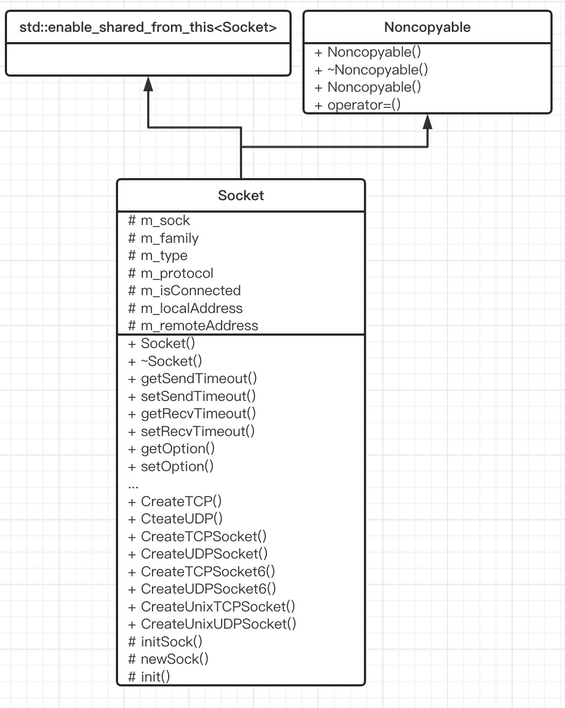

# Socket模块

> 套接字类，表示一个套接字对象。



## 1. 模块设计

对于套接字类，需要关注以下属性：

1. 文件描述符
2. 地址类型（AF_INET, AF_INET6等）
3. 套接字类型（SOCK_STREAM, SOCK_DGRAM等）
4. 协议类型（这项其实可以忽略）
5. 是否连接（针对TCP套接字，如果是UDP套接字，则默认已连接）
6. 本地地址和对端的地址

套接字类应提供以下方法：

1. 创建各种类型的套接字对象的方法（TCP套接字，UDP套接字，Unix域套接字）
2. 设置套接字选项，比如超时参数
3. bind/connect/listen方法，实现绑定地址、发起连接、发起监听功能 
4. accept方法，返回连入的套接字对象
5. 发送、接收数据的方法
6. 获取本地地址、远端地址的方法
7. 获取套接字类型、地址类型、协议类型的方法
8. 取消套接字读、写的方法

## 2. 模块实现

### 2.1 Socket

> 套接字类，继承enable_shared_from_this，且无法拷贝赋值

```C++
class Socket : public std::enable_shared_from_this<Socket>, Noncopyable {
public:
    typedef std::shared_ptr<Socket> ptr;
    typedef std::weak_ptr<Socket> weak_ptr;

    /**
     * @brief Socket类型
     */
    enum Type {
        /// TCP类型
        TCP = SOCK_STREAM,
        /// UDP类型
        UDP = SOCK_DGRAM
    };

    /**
     * @brief Socket协议簇
     */
    enum Family {
        /// IPv4 socket
        IPv4 = AF_INET,
        /// IPv6 socket
        IPv6 = AF_INET6,
        /// Unix socket
        UNIX = AF_UNIX,
    };

...
protected:
    int m_sock;
    int m_family;
    int m_type;
    int m_protocol;
    bool m_isConnected;
    Address::ptr m_localAddress;
    Address::ptr m_remoteAddress;
};
```

## 3. 总结

一个完整的套接字类，创建包括TCP套接字、UDP套接字、Unix域套接字等等，还有各种套接字选项参数，实现绑定地址、发起连接、发起监听功能，可以获取本地和远端地址、套接字类型、地址类型、协议类型等等。