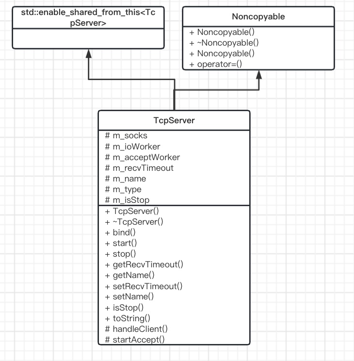

# TcpServer模块

> 基于Socket类，封装了一个通用的TcpServer的服务器类，提供简单的API，使用便捷。



# 1. 模块设计

TcpServer类支持同时绑定多个地址进行监听，只需要在绑定时传入地址数组即可。TcpServer还可以分别指定接收客户端和处理客户端的协程调度器。

比较好的TcpServer可以快速绑定一个或多个地址，启动服务，监听端口，accept连接，处理socket连接等功能。具体业务功能更的服务器实现，只需要继承该类就可以快速实现.


# 2. 模块实现

## 2.1 TcpServer

> TCP服务器封装

```C++
class TcpServer : public std::enable_shared_from_this<TcpServer>
                    , Noncopyable {
public:
    typedef std::shared_ptr<TcpServer> ptr;

...
protected:
    /// 监听Socket数组
    std::vector<Socket::ptr> m_socks;
    /// 新连接的Socket工作的调度器
    IOManager* m_ioWorker;
    /// 服务器Socket接收连接的调度器
    IOManager* m_acceptWorker;
    /// 接收超时时间(毫秒)
    uint64_t m_recvTimeout;
    /// 服务器名称
    std::string m_name;
    /// 服务器类型
    std::string m_type;
    /// 服务是否停止
    bool m_isStop;
};
```

# 3. Usage

通过自定义TcpServer，并且重载HandleClient方法即可。

```C++
class MyTcpServer : public jujimeizuo::TcpServer {
protected:
    virtual void handleClient(jujimeizuo::Socket::ptr client) override;
};

void MyTcpServer::handleClient(jujimeizuo::Socket::ptr client) {
    JUJIMEIZUO_LOG_INFO(g_logger) << "new client: " << client->toString();
    static std::string buf;
    buf.resize(4096);
    client->recv(&buf[0], buf.length()); // 这里有读超时，由tcp_server.read_timeout配置项进行配置，默认120秒
    JUJIMEIZUO_LOG_INFO(g_logger) << "recv: " << buf;
    client->close();
}
```

# 4. 总结

TcpServer类采用了Template Pattern设计模式，它的HandleClient是交由继承类来实现的。使用TcpServer时，必须从TcpServer派生一个新类，并重新实现子类的handleClient操作。

